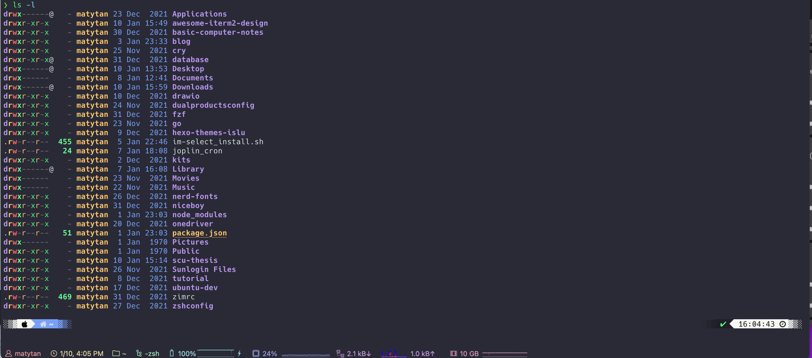

# Awesome-iTerm2-Color

## Final effect 最终效果 
1. **Files**
 

2.**commands** 

3.**htop** 

4.**fetch**  

## How to use it
- Clone the repo or download the file material-design-colors.itermcolors
- iTerm2 > Preferences > Profiles > Colors Tab
- Click Color Presets...
- Click Import...
- Select the awesome_maty.itermcolors file
- Select the awesome_maty from Load Presets...

## the below tab
- iTerm2 > Preferences > Profiles > session > status bar enable
 

## Inspiration
- Dracula
- OneDark
- Nord
